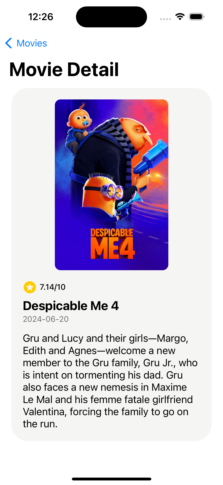
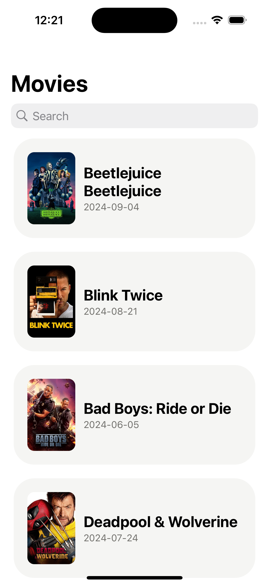
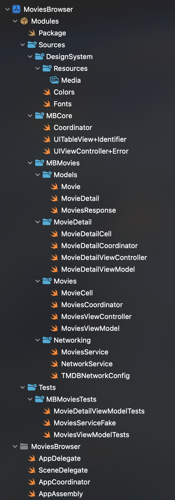

# MoviesBrowser

MoviesBrowser is an iOS application that allows users to browse and search for movies using The Movie Database (TMDb) API. This project demonstrates the implementation of modern iOS development practices, including clean architecture, MVVM-C pattern, and unit testing.

<div style="display: flex; justify-content: center;">
  
  
</div>

## Features

- Browse popular movies
- Search for movies by title
- View detailed information about selected movies

## Architecture

This project is built using the following architectural patterns and principles:

- **Clean Architecture**: Ensures separation of concerns and maintainability
- **MVVM-C (Model-View-ViewModel with Coordinator)**: For presentation layer and navigation
- **Dependency Injection**: For better testability and modularity
- **Repository Pattern**: For data management and abstraction of data sources

## Tech Stack

- Swift
- UIKit
- Combine (for reactive programming)
- XCTest (for unit testing)
- Swift Package Manager (SPM) for modularization and dependency management

## Project Structure

The project follows a modular architecture with the following main components:

<div style="display: flex; justify-content: left;">
  
</div>

- `NetworkService`: Handles all network requests
- `DesignSystem`: Manages the design guidelines with fonts and colors
- `MBCore`: Contain the shared core functionality of the app
- `MBMovies`: UI components with MVVM-C Architecture

## Setup Instructions

1. Clone the repository:

   ```
   git clone https://github.com/piotrantkiewicz/MoviesBrowser.git
   ```

2. Open `MoviesBrowser.xcodeproj` in Xcode.

3. Set up your TMDb API Key:

   - Sign up for a TMDb API key at [https://developer.themoviedb.org](https://developer.themoviedb.org)
   - Open the `Info.plist` file in your project
   - Add a new key called `TMDBAPIAccessToken`
   - Set the value of this key to your TMDb API access token

4. Install dependencies:

   - The project uses Swift Package Manager for dependency management
   - Xcode should automatically fetch the dependencies when you open the project
   - If not, go to File > Packages > Resolve Package Versions

5. Build and run the project in Xcode.

## Running Tests

To run the unit tests:

1. In Xcode, go to Product > Test or use the shortcut `⌘U`
2. The test results will appear in the Test navigator

## Third-Party Libraries

This project uses the following third-party libraries:

1. **SDWebImage**: Used for efficient loading and caching of images from the network.
2. **SnapKit**: A DSL for creating Auto Layout constraints programmatically, making it easier to create and manage complex layouts.
3. **Swinject**: A dependency injection framework for Swift, used to improve testability and modularity of the app.

All these libraries are integrated using Swift Package Manager.

## Error Handling

The app implements comprehensive error handling for network requests and other potential issues. User-friendly error messages are displayed when appropriate to enhance the user experience.

## Future Improvements

- Implement caching for offline support
- Add pagination for movie lists
- Enhance UI with custom designs and animations
- Implement localization for multiple language support

## Contributing

Contributions are welcome! Please feel free to submit a Pull Request.

## License

This project is licensed under the MIT License - see the [LICENSE.md](LICENSE.md) file for details.
